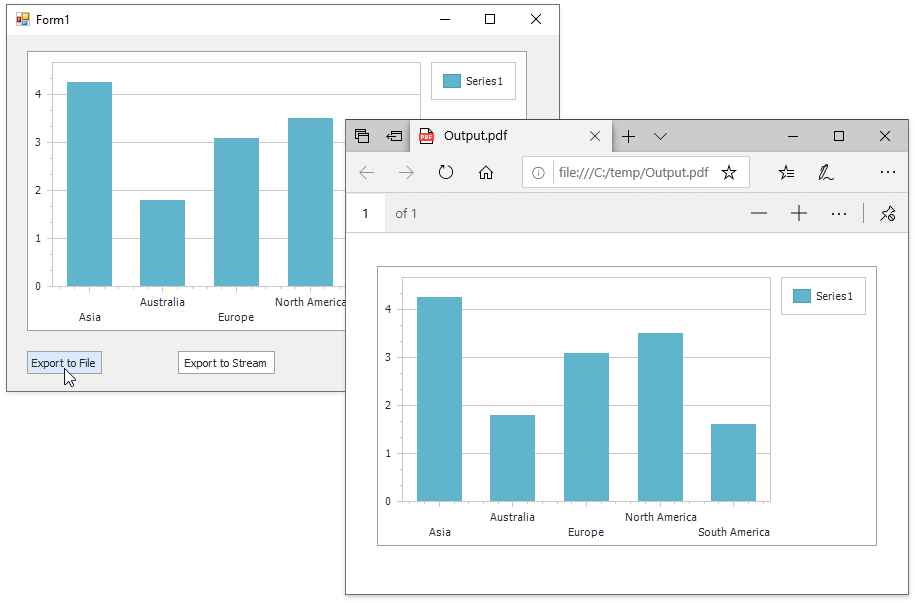

<!-- default badges list -->

<!-- default badges end -->
<!-- default file list -->
*Files to look at*:

* [Form1.cs](./CS/Form1.cs) (VB: [Form1.vb](./VB/Form1.vb))
<!-- default file list end -->
# How to: Export a Chart to PDF

The following example exports a chart to a PDF format. In this example, the form contains the _Export to File_ and _Export to Stream_ buttons that allow you to save the PDF document with the chart to a file or a stream.

Follow the steps below to implement this scenario:

* Add a [Chart Control](https://docs.devexpress.com/WindowsForms/DevExpress.XtraCharts.ChartControl) object to the form. Make sure that the Chart Control _Name_ is _chartControl1_ in the Visual Studio _Properties_ window. For more information, see the following topic: [How to: Add a Chart to a Windows Forms Application](https://docs.devexpress.com/WindowsForms/2957/controls-and-libraries/chart-control/examples/general/how-to-add-a-chart-to-a-windows-forms-application).

* Create a [Series](https://docs.devexpress.com/CoreLibraries/DevExpress.XtraCharts.Series) object in the _Form1_Load_ event handler. Use the [ChartControl.Series.Add](https://docs.devexpress.com/CoreLibraries/DevExpress.XtraCharts.SeriesCollection.Add(DevExpress.XtraCharts.Series)) method to add this series to the chart.

* Specify the [ChartControl.DataSource](https://docs.devexpress.com/WindowsForms/DevExpress.XtraCharts.ChartControl.DataSource), [Series.ArgumentDataMember](https://docs.devexpress.com/CoreLibraries/DevExpress.XtraCharts.SeriesBase.ArgumentDataMember), and [Series.ValueDataMembers](https://docs.devexpress.com/CoreLibraries/DevExpress.XtraCharts.SeriesBase.ValueDataMembers) properties to populate the chart with data. In this example, the _GetSales_ method returns the chart data source.

* Add two [SimpleButtons](https://docs.devexpress.com/WindowsForms/DevExpress.XtraEditors.SimpleButton) to the form. Set the first button's [Text](https://docs.devexpress.com/WindowsForms/DevExpress.XtraEditors.SimpleButton.Text) property to _Export to File_ and the second button's property to _Export to Stream_. 

* The Chart Control uses the [DevExpress Printing Library](https://docs.devexpress.com/WindowsForms/2079/controls-and-libraries/printing-exporting) to export a chart. To use this library, add references to the following assemblies to the project: 
  * _DevExpress.XtraPrinting.19.2_,
  * _DevExpress.Printing.v19.2.Core_.

* Handle the first button's [Click](https://docs.microsoft.com/en-us/dotnet/api/system.windows.forms.control.click?view=net-5.0) event and use the [ChartControl.IsPrintingAvailable](https://docs.devexpress.com/WindowsForms/DevExpress.XtraCharts.ChartControl.IsPrintingAvailable) property to check whether the chart can be exported. Call the [ChartControl.ExportToPdf(String, PdfExportOptions)](https://docs.devexpress.com/WindowsForms/DevExpress.XtraCharts.ChartControl.ExportToPdf(System.String-DevExpress.XtraPrinting.PdfExportOptions)) method to export the chart to a file. Pass the path to this file as the first parameter to the **ExportToPdf** method. Create an instance of the [PdfExportOptions](https://docs.devexpress.com/CoreLibraries/DevExpress.XtraPrinting.PdfExportOptions) class to specify export settings. Set the [PdfExportOptions.ConvertImagesToJpeg](https://docs.devexpress.com/CoreLibraries/DevExpress.XtraPrinting.PdfExportOptions.ConvertImagesToJpeg) property to **false** to export the chart in the vector-based format. Pass the **PdfExportOptions** instance as the second parameter to the **ExportToPdf** method.  

* Handle the second button's [Click](https://docs.microsoft.com/en-us/dotnet/api/system.windows.forms.control.click?view=net-5.0) event and use the [ChartControl.IsPrintingAvailable](https://docs.devexpress.com/WindowsForms/DevExpress.XtraCharts.ChartControl.IsPrintingAvailable) property to check whether the chart can be exported. Call the [ChartControl.ExportToPdf(System.IO.Stream)](https://docs.devexpress.com/WindowsForms/DevExpress.XtraCharts.ChartControl.ExportToPdf(System.IO.Stream)) method to export the chart to a stream. This example uses [FileStream](https://docs.microsoft.com/en-us/dotnet/api/system.io.filestream?view=net-5.0), and you can open the file where the stream is saved to check the export result.
